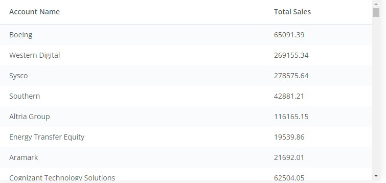
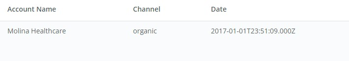
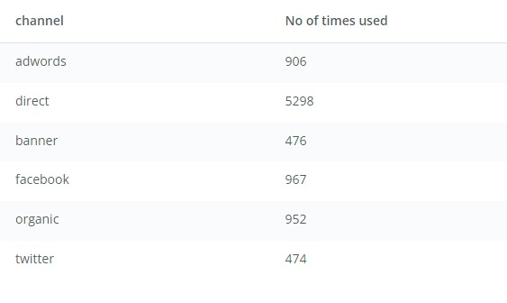
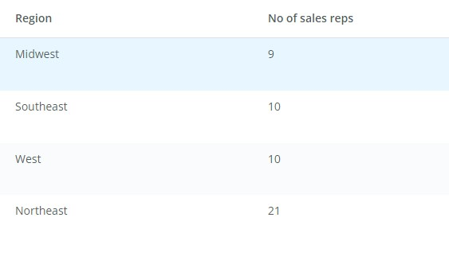
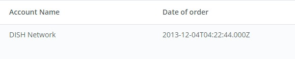

# **INTRODUCTION TO PROGRAMMING IN DATA SCIENCE ON UDACITY**.
This repo focuses on some of the sql query question and my query response to those questions. 

## **ERD AND BRIEF INFO OF THE DATABASE**

# **Questions**

1.**Find the total sales in usd for each account. You should include two columns - the total sales for each company's orders in usd and the company name.**

**Approach to solving this** 
This involves joining both the account and orders table in order to be able to extract the needed information. Then, using the `SUM` aggregator would be the next appropriate measure.

The table below is the result from the query and the query script can be viewed [here](./question1.sql)

2.**Via what channel did the most recent (latest) web_event occur, which account was associated with this web_event? Your query should return only three values - the date, channel, and account name.**

**Approach to solving this** 
This requires the merging of accounts and web_events table.

The table below is the result from the query and the query script can be viewed [here](./question2.sql)

3.**Find the total number of times each type of channel from the web_events was used. Your final table should have two columns - the channel and the number of times the channel was used.**

**Approach to solving this** 
The channels column is in the web_events table so we aren't joining two tables together. The query only needs to count the number of times each unique channel was used

The table below is the result from the query and the query script can be viewed [here](./question3.sql)

4.**Find the number of sales reps in each region. Your final table should have two columns - the region and the number of sales_reps. Order from fewest reps to most reps.**

**Approach to solving this** 
We need to join the sales rep table and the region table together in order to extract information from both tables. Then we need to group each sales rep by region and then count them. We then need to have a visual view of the region with few sales rep to most sales reps

The table below is the result from the query and the query script can be viewed [here](./question4.sql)

5.**Which account (by name) placed the earliest order? Your solution should have the account name and the date of the order.**
 
**Approach to solving this** 
 From this question and knowledge of the ERD diagram, we need to join the accounts and orders table together. It's going to be an `INNER` JOIN because we need the date of the first order and the account who made the order, there is no room for NULLS here. The next thing of note is that we want the earliest order which means that we have to write a query that will filter for our earliest order.

The table below is the result from the query and the query script can be viewed [here](./question5.sql)

