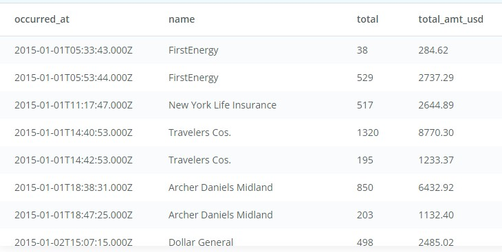

# **INTRODUCTION TO PROGRAMMING IN DATA SCIENCE ON UDACITY**.
This repo focuses on some of the sql query question and my query response to those questions. 

## **ERD AND BRIEF INFO OF THE DATABASE**


# **Questions**

1. **Provide a table that provides the region for each sales_rep along with their associated accounts. This time only for the Midwest region. Your final table should include three columns: the region name, the sales rep name, and the account name. Sort the accounts alphabetically (A-Z) according to account name.**

**Approach to solving this**<br>

The first thing to note are the tables from which the information would be gotten. The ```sales rep name``` is needed(this can be gotten from the sales rep table), the ```region``` each sales rep is(can be gotten from the region's table) and the ```accounts``` they have opened(can be gotten from the accounts table). Then, the next thing of importance is to limit the region viewed to only the ```Midwests``` region and then the account name should be ordered from A-Z

This means three tables have to be joined together in order to extract the information requested. Since i need ```all``` the accounts **associated** with each sales rep i.e only the sales rep with accounts are needed as well as their region, i would be performing an inner join. 

The table below is the result from the query and the query script can be viewed [here](./question1.sql)


2. **Provide a table that provides the region for each sales_rep along with their associated accounts. This time only for accounts where the sales rep has a first name starting with S and in the Midwest region. Your final table should include three columns: the region name, the sales rep name, and the account name. Sort the accounts alphabetically (A-Z) according to account name.**

**Approach to solving this**<br>
This is similar to question 1 except that we are filtering for Midwest region as well as sales rep with first name starting with S. This calls for the use of ```wildcards```

The table below is the result from the query and the query script can be viewed [here](./question2.sql)


3. **What are the different channels used by account id 1001? Your final table should have only 2 columns: account name and the different channels. You can try SELECT DISTINCT to narrow down the results to only the unique values.**

**Approach to solving this**<br>
Where can we find the channels column since it isn't a table in our database? The channels column can be found in the web_events table. There's already a hint on how to select only the unique channel and of course, the account id can be found on the accounts table. This means i will be joining the two tables together: accounts table and web_events table.

The table below is the result from the query and the query script can be viewed [here](./question3.sql)


4. **Find all the orders that occurred in 2015. Your final table should have 4 columns: occurred_at, account name, order total, and order total_amt_usd.**

**Approach to solving this**<br>
From the query question, it is evident that we need to join the orders and accounts table. Then, limit the query to only orders in the year 2015.

The table below is the result from the query and the query script can be viewed [here](./question4.sql)



